# 🏦 Agentic SDLC Harness — Banking Account Opening

> **Demo de Spec-Driven Development (SDD) y Spec-Driven Architecture (SDA)**  
> usando **GitHub Spec Kit** + **GitHub Copilot Agents** para cubrir el ciclo de vida 
> completo de desarrollo (SDLC) en un caso de uso bancario.

---

## 📋 Tabla de Contenidos

- [¿Qué es este demo?](#-qué-es-este-demo)
- [Arquitectura del Harness](#-arquitectura-del-harness)
- [Estructura del Proyecto](#-estructura-del-proyecto)
- [Prerrequisitos](#-prerrequisitos)
- [Instalación desde Cero](#-instalación-desde-cero)
- [▶️ Ejecutar el Demo — Proceso Completo](#️-ejecutar-el-demo--proceso-completo)
- [Agentes Disponibles](#-agentes-disponibles)
- [Skills Bancarios Atómicos](#-skills-bancarios-atómicos)
- [Artefactos Generados](#-artefactos-generados)
- [Referencia de Comandos Spec Kit](#-referencia-de-comandos-spec-kit)

---

## 🎯 ¿Qué es este demo?

Este proyecto demuestra cómo **GitHub Copilot** puede actuar como un **harness agéntico** 
que orquesta el ciclo de vida completo del software (SDLC) guiado por especificaciones.

### Conceptos Clave

| Concepto | Descripción |
|---------|-------------|
| **SDD** (Spec-Driven Development) | El desarrollo se guía por un spec estructurado, no por prompts vagos |
| **SDA** (Spec-Driven Architecture) | La arquitectura técnica se deriva directamente del spec aprobado |
| **Spec Kit** | Framework oficial de GitHub para SDD — convierte specs en planes, tareas y código |
| **Agente Orquestador** | `banking-harness-agent` coordina las 5 fases del SDLC |
| **Agentes de Fase** | Un agente especializado por cada fase del SDLC (requisitos, arquitectura, dev, testing, seguridad) |
| **Skills Atómicos** | Tareas reutilizables de una sola responsabilidad que los agentes invocan automáticamente |

### Caso de Uso Bancario

> **"Un cliente desea abrir una cuenta de ahorros digital"**

El harness toma esta necesidad de negocio y, paso a paso, produce:
- ✅ Especificación funcional con cobertura KYC/AML/GDPR
- ✅ Arquitectura técnica trazable al spec
- ✅ Clasificación de datos PII/sensibles
- ✅ Código Angular implementado
- ✅ Suite de pruebas derivada del spec
- ✅ Reporte de seguridad y compliance
- ✅ PR listo para revisión

---

## 🔄 Flujo Típico de Spec Kit

```mermaid
flowchart TD
    subgraph SETUP["⚙️ SETUP — Inicialización del proyecto"]
        INIT["🚀 specify init<br/>Inicializa Spec Kit en el repo"]
        CONST["📜 speckit.constitution<br/>Define principios: Security-First, KYC/AML"]
    end

    subgraph PHASE1["📋 FASE 1 — Especificación funcional"]
        SPEC["📝 speckit.specify<br/>Genera spec.md con requisitos"]
        CLARIFY["🔍 speckit.clarify<br/>Resuelve ambigüedades del spec"]
        SA["📄 spec.md<br/>Especificación aprobada"]
        G1{"✅ Gate 1<br/>¿Spec completo?"}
    end

    subgraph PHASE2["🏗️ FASE 2 — Arquitectura técnica"]
        PLAN["🏛️ speckit.plan<br/>Diseña arquitectura trazable al spec"]
        CHECK["☑️ speckit.checklist<br/>Valida calidad del plan"]
        ANALYZE["🔎 speckit.analyze<br/>Detecta brechas spec ↔ plan"]
        PA["📄 plan.md<br/>Plan de arquitectura aprobado"]
        G2{"✅ Gate 2<br/>¿Sin gaps críticos?"}
    end

    subgraph PHASE3["💻 FASE 3 — Implementación"]
        TASKS["📋 speckit.tasks<br/>Genera tareas ordenadas por dependencia"]
        IMPL["⚙️ speckit.implement<br/>Genera código Angular + OpenAPI"]
        CONV["🔄 speckit.converge<br/>Verifica completitud de todas las tareas"]
        CA["📦 tasks.md + src/<br/>Código y contrato API generados"]
        G3{"✅ Gate 3<br/>¿Convergencia limpia?"}
    end

    PR["🎉 PR listo<br/>Trazabilidad completa negocio → código"]

    INIT --> CONST
    CONST --> SPEC
    SPEC --> CLARIFY
    CLARIFY --> SA
    SA --> G1
    G1 -->|"❌ incompleto"| CLARIFY
    G1 -->|"✅ aprobado"| PLAN
    PLAN --> CHECK
    CHECK --> ANALYZE
    ANALYZE --> PA
    PA --> G2
    G2 -->|"❌ gaps"| PLAN
    G2 -->|"✅ ok"| TASKS
    TASKS --> IMPL
    IMPL --> CONV
    CONV --> CA
    CA --> G3
    G3 -->|"❌ pendientes"| IMPL
    G3 -->|"✅ completo"| PR

    style INIT fill:#1e3a5f,stroke:#38bdf8,color:#e0f2fe
    style CONST fill:#1e3a5f,stroke:#38bdf8,color:#e0f2fe
    style SPEC fill:#064e3b,stroke:#34d399,color:#d1fae5
    style CLARIFY fill:#064e3b,stroke:#34d399,color:#d1fae5
    style SA fill:#0f2027,stroke:#34d399,color:#a7f3d0
    style G1 fill:#14532d,stroke:#4ade80,color:#bbf7d0
    style PLAN fill:#3b0764,stroke:#c084fc,color:#f3e8ff
    style CHECK fill:#3b0764,stroke:#c084fc,color:#f3e8ff
    style ANALYZE fill:#3b0764,stroke:#c084fc,color:#f3e8ff
    style PA fill:#0f2027,stroke:#c084fc,color:#e9d5ff
    style G2 fill:#14532d,stroke:#4ade80,color:#bbf7d0
    style TASKS fill:#3b1f00,stroke:#fb923c,color:#ffedd5
    style IMPL fill:#3b1f00,stroke:#fb923c,color:#ffedd5
    style CONV fill:#3b1f00,stroke:#fb923c,color:#ffedd5
    style CA fill:#0f2027,stroke:#fb923c,color:#fed7aa
    style G3 fill:#14532d,stroke:#4ade80,color:#bbf7d0
    style PR fill:#713f12,stroke:#facc15,color:#fef9c3
    style SETUP fill:#0f172a,stroke:#475569,color:#94a3b8
    style PHASE1 fill:#022c22,stroke:#34d399,color:#6ee7b7
    style PHASE2 fill:#2e1065,stroke:#c084fc,color:#d8b4fe
    style PHASE3 fill:#431407,stroke:#fb923c,color:#fdba74
```




---

## 🏗️ Arquitectura del Harness

```
Usuario
  │
  ▼
@banking-harness-agent          ← ORQUESTADOR: detecta fase, coordina y verifica gates
  │
  ├── FASE 1 → @banking-requirements-agent
  │              invoca: #enrich-banking-spec
  │              invoca: #validate-compliance-coverage
  │              usa:    /speckit.specify  /speckit.clarify
  │              gate:   spec.md ✅ + compliance PASS
  │
  ├── FASE 2 → @banking-architect-agent
  │              invoca: #validate-compliance-coverage
  │              invoca: #classify-pii-fields
  │              usa:    /speckit.plan  /speckit.checklist  /speckit.analyze
  │              gate:   plan.md ✅ + sin gaps críticos
  │
  ├── FASE 3 → @banking-developer-agent
  │              invoca: #classify-pii-fields
  │              usa:    /speckit.tasks  /speckit.implement  /speckit.converge
  │              gate:   código ✅ + convergencia limpia
  │
  ├── FASE 4 → @banking-tester-agent
  │              invoca: #validate-compliance-coverage
  │              gate:   cobertura ≥ 80% + todos los escenarios compliance ✅
  │
  └── FASE 5 → @banking-security-agent
                 invoca: #validate-compliance-coverage
                 invoca: #classify-pii-fields
                 gate:   sin hallazgos CRÍTICOS → PR listo ✅
```

### Skills atómicos (invocados por los agentes, no por el usuario)

| Skill | Responsabilidad única |
|-------|----------------------|
| `#enrich-banking-spec` | Enriquece descripción cruda → lista para `/speckit.specify` |
| `#validate-compliance-coverage` | Valida cobertura KYC/AML/PCI-DSS/GDPR → checklist pass/fail |
| `#classify-pii-fields` | Clasifica campos → tabla PII/sensible/público con retención GDPR |

---

## 📁 Estructura del Proyecto

```
banking-account-opening/
│
├── 📂 .specify/                           ← Spec Kit: estado y plantillas (framework, no modificar)
│   ├── memory/
│   │   └── constitution.md               ← Principios del proyecto (Security-First, KYC/AML)
│   ├── templates/                        ← Plantillas de spec, plan, tasks, checklist
│   ├── scripts/powershell/               ← Scripts CLI generados por spec-kit
│   └── workflows/                        ← Definición de flujos de trabajo
│
├── 📂 .github/
│   ├── agents/                           ← Agentes Copilot
│   │   ├── speckit.*.agent.md            ← Agentes de Spec Kit (framework, no modificar)
│   │   ├── banking-harness-agent.md      ← 🎛️  Orquestador SDLC
│   │   ├── banking-requirements-agent.md ← 📋 Fase 1: Requisitos
│   │   ├── banking-architect-agent.md    ← 🏛️  Fase 2: Arquitectura (SDA)
│   │   ├── banking-developer-agent.md    ← 💻 Fase 3: Desarrollo
│   │   ├── banking-tester-agent.md       ← 🧪 Fase 4: Pruebas
│   │   └── banking-security-agent.md     ← 🔒 Fase 5: Seguridad & Compliance
│   │
│   ├── prompts/
│   │   └── speckit.*.prompt.md           ← Prompts de Spec Kit (framework, no modificar)
│   │
│   └── skills/                           ← Skills atómicos bancarios
│       ├── enrich-banking-spec/
│       │   └── SKILL.md                  ← Enriquece descripción con KYC/AML/GDPR
│       ├── validate-compliance-coverage/
│       │   └── SKILL.md                  ← Valida cobertura regulatoria (pass/fail)
│       └── classify-pii-fields/
│           └── SKILL.md                  ← Clasifica campos PII/sensible/público
│
├── 📂 specs/                             ← Artefactos SDD (generados por el harness)
│   └── 001-savings-account-opening/
│       ├── spec.md                       ← Especificación funcional
│       ├── plan.md                       ← Plan de arquitectura
│       ├── tasks.md                      ← Tareas de implementación
│       ├── analysis.md                   ← Análisis spec↔plan
│       ├── convergence.md                ← Verificación de completitud
│       ├── checklists/
│       │   ├── requirements.md           ← Calidad del spec
│       │   └── architecture.md           ← Calidad de arquitectura
│       ├── test-coverage-report.md       ← Cobertura de pruebas
│       ├── compliance-test-matrix.md     ← Trazabilidad spec ↔ tests
│       └── security-report.md            ← Hallazgos de seguridad
│
└── 📂 src/                               ← Código Angular generado (Fase 3)
    ├── app/features/account-opening/
    └── api/api.spec.yaml                 ← Contrato OpenAPI 3.0
```

---

## ✅ Prerrequisitos

| Herramienta | Versión mínima | Para qué |
|------------|---------------|---------|
| **Python** | 3.10+ | Ejecutar spec-kit CLI |
| **pipx** | 1.0+ | Instalación persistente de spec-kit |
| **Git** | 2.0+ | Requerido por spec-kit |
| **GitHub Copilot** | Plan con Agents | Ejecutar agentes locales en VS Code |
| **VS Code** | Última | Editor con Copilot Chat |
| **Node.js** | 18+ | Opcional — para ejecutar el código Angular generado |

```powershell
python --version   # Python 3.x.x
pipx --version     # 1.x.x
git --version      # git version 2.x.x
```

---

## 🚀 Instalación desde Cero

### Paso 1: Clonar el repositorio

```powershell
git clone <repo-url>
cd banking-account-opening
```

> Si instalas desde cero (sin clonar), sigue los pasos 2-4:

```powershell
mkdir banking-account-opening
cd banking-account-opening
git init
git config user.email "tu@email.com"
git config user.name "Tu Nombre"
```

### Paso 2: Instalar GitHub Spec Kit

```powershell
pipx install git+https://github.com/github/spec-kit.git
specify --version   # verificar instalación
```

> Si `specify` no está en el PATH: `pipx ensurepath` y reinicia la terminal.

### Paso 3: Inicializar Spec Kit

```powershell
"y" | specify init . --script ps
```

Genera: `.specify/`, `.github/agents/speckit.*`, `.github/prompts/speckit.*`

### Paso 4: Abrir en VS Code

```powershell
code .
```

Asegúrate de que **GitHub Copilot Chat** está activo y que puedes ver los agentes 
en el selector `@` del chat.

---

## ▶️ Ejecutar el Demo — Proceso Completo

> Todos los comandos se escriben en **GitHub Copilot Chat** dentro de VS Code,  
> con la carpeta `banking-account-opening` abierta como workspace.

---

### 🔧 Paso 0 — Constitución (ya incluida, solo la primera vez)

La constitución bancaria ya está pre-configurada en `.specify/memory/constitution.md`.  
Si necesitas redefinirla:

```
/speckit.constitution This is a Security-First banking application. All features must 
comply with KYC, AML, PCI-DSS. TDD mandatory, 80% coverage minimum. No PII in logs. 
OAuth 2.0 + MFA required for all account operations.
```

---

### 🚦 Paso 1 — Invocar el Orquestador

El único comando que necesitas para arrancar:

```
@banking-harness-agent Quiero que los clientes puedan abrir una cuenta de ahorros digital
```

El orquestador:
1. Lee el workspace para detectar en qué fase del SDLC estás
2. Muestra el estado actual: fases completadas y siguiente paso
3. Delega automáticamente al agente de la fase correspondiente

---

### 📋 Paso 2 — Fase 1: Requirements

El `banking-requirements-agent` toma el control automáticamente:

| Acción | Qué hace |
|--------|---------|
| Invoca `#enrich-banking-spec` | Transforma la descripción cruda en una descripción enriquecida con KYC/AML/GDPR |
| Ejecuta `/speckit.specify` | Genera `specs/001-savings-account-opening/spec.md` |
| Invoca `#validate-compliance-coverage` | Verifica que el spec cubra KYC, AML, GDPR y audit trail |
| Ejecuta `/speckit.clarify` | Si hay items `[NEEDS CLARIFICATION]`, los resuelve |

**Gate de salida**: `spec.md` completo + compliance coverage = ✅ PASS  
**Artefactos**: `specs/001-.../spec.md`, `checklists/requirements.md`

---

### 🏛️ Paso 3 — Fase 2: Architecture (SDA)

El `banking-architect-agent` entra en acción:

| Acción | Qué hace |
|--------|---------|
| Invoca `#validate-compliance-coverage` | Confirma que el spec tiene todos los requisitos antes de diseñar |
| Invoca `#classify-pii-fields` | Clasifica todos los campos del modelo de datos (PII/sensible/público) |
| Ejecuta `/speckit.plan` | Genera `plan.md` con la arquitectura técnica |
| Ejecuta `/speckit.checklist` | Valida calidad del plan |
| Ejecuta `/speckit.analyze` | Detecta brechas entre spec y plan |

**Gate de salida**: `plan.md` ✅ + análisis sin gaps críticos  
**Artefactos**: `plan.md`, `checklists/architecture.md`, `analysis.md`

---

### 💻 Paso 4 — Fase 3: Development

El `banking-developer-agent` implementa:

| Acción | Qué hace |
|--------|---------|
| Invoca `#classify-pii-fields` | Define qué campos no pueden ir en logs ni en respuestas sin máscara |
| Ejecuta `/speckit.tasks` | Genera lista de tareas ordenadas por dependencia |
| Ejecuta `/speckit.implement` | Genera código Angular: componentes, servicios, modelos, OpenAPI |
| Ejecuta `/speckit.converge` | Verifica que todas las tareas están completas |

> Si `/speckit.converge` reporta gaps, ejecuta `/speckit.implement` de nuevo hasta convergencia.

**Gate de salida**: todas las tareas done + `/speckit.converge` limpio  
**Artefactos**: `tasks.md`, `convergence.md`, `src/`, `api.spec.yaml`

---

### 🧪 Paso 5 — Fase 4: Testing

El `banking-tester-agent` genera los tests:

| Acción | Qué hace |
|--------|---------|
| Invoca `#validate-compliance-coverage` | Extrae cada requisito KYC/AML/GDPR como caso de prueba obligatorio |
| Genera `*.spec.ts` | Un test por cada criterio de aceptación del spec |
| Genera tests de compliance | KYC rejection, AML flag, session timeout, PII leak prevention |
| Genera reporte de cobertura | Matriz spec ↔ tests |

**Gate de salida**: cobertura ≥ 80% + todos los escenarios de compliance cubiertos  
**Artefactos**: `src/**/*.spec.ts`, `test-coverage-report.md`, `compliance-test-matrix.md`

---

### 🔒 Paso 6 — Fase 5: Security Review

El `banking-security-agent` audita:

| Acción | Qué hace |
|--------|---------|
| Invoca `#validate-compliance-coverage` | Obtiene la lista completa de requisitos regulatorios a verificar |
| Invoca `#classify-pii-fields` | Verifica que campos PII están encriptados y ausentes en logs |
| Revisa código contra OWASP Top 10 | Auth, XSS, injection, secrets en código |
| Verifica PCI-DSS, KYC/AML, GDPR | Cobertura regulatoria completa |
| Genera reporte con severidades | 🔴 CRITICAL / 🟠 HIGH / 🟡 MEDIUM / 🔵 LOW |

**Gate de salida**: sin hallazgos 🔴 CRITICAL  
**Artefactos**: `security-report.md`

---

### ✅ Paso 7 — Convergencia Final y PR

```
/speckit.converge
```

El orquestador verifica que todos los artefactos del SDLC existen:

```
specs/001-savings-account-opening/
  ✅ spec.md
  ✅ plan.md
  ✅ analysis.md
  ✅ tasks.md
  ✅ convergence.md
  ✅ test-coverage-report.md
  ✅ security-report.md

src/
  ✅ app/features/account-opening/
  ✅ api/api.spec.yaml
```

→ **PR listo** con trazabilidad completa: negocio → spec → arquitectura → código → tests → seguridad

---

### 📊 Resumen del flujo

```mermaid
flowchart TD
    USER["👤 Usuario<br/>Escribe la necesidad de negocio"]
    ORCH["🎛️ banking-harness-agent<br/>Orquestador: detecta fase, coordina y verifica gates"]

    subgraph F1["📋 FASE 1 — Requirements"]
        REQ["📋 banking-requirements-agent<br/>Captura la necesidad de negocio bancaria"]
        SK1(["🔧 #enrich-banking-spec<br/>Transforma descripción cruda → input con KYC/AML/GDPR"])
        SPECIFY["📝 /speckit.specify<br/>Genera spec.md estructurado desde descripción enriquecida"]
        SK1B(["🔧 #validate-compliance-coverage<br/>Verifica cobertura KYC, AML, PCI-DSS, GDPR"])
        CLARIFY["🔍 /speckit.clarify<br/>Resuelve ambigüedades de compliance en el spec"]
        A1["📄 spec.md<br/>Especificación funcional completa"]
        G1{"✅ Gate 1<br/>¿Compliance PASS?"}
    end

    subgraph F2["🏗️ FASE 2 — Architecture"]
        ARC["🏛️ banking-architect-agent<br/>Diseña arquitectura trazable al spec (SDA)"]
        SK2(["🔧 #validate-compliance-coverage<br/>Confirma KYC/AML/GDPR antes de diseñar"])
        SK2B(["🔧 #classify-pii-fields<br/>Clasifica campos PII / sensible / público"])
        PLAN["📐 /speckit.plan<br/>Genera plan.md con arquitectura bancaria"]
        CHECK["☑️ /speckit.checklist<br/>Valida calidad del plan de arquitectura"]
        ANALYZE["🔎 /speckit.analyze<br/>Detecta brechas entre spec y plan"]
        A2["📄 plan.md + analysis.md<br/>Arquitectura aprobada sin gaps críticos"]
        G2{"✅ Gate 2<br/>¿Sin gaps críticos?"}
    end

    subgraph F3["💻 FASE 3 — Development"]
        DEV["💻 banking-developer-agent<br/>Implementa el código Angular y el contrato API"]
        SK3(["🔧 #classify-pii-fields<br/>Define campos excluidos de logs y respuestas"])
        TASKS["📋 /speckit.tasks<br/>Genera tareas ordenadas por dependencia"]
        IMPL["⚙️ /speckit.implement<br/>Genera código Angular + OpenAPI"]
        CONV["🔄 /speckit.converge<br/>Verifica completitud de todas las tareas"]
        A3["📦 tasks.md + src/<br/>Código Angular + OpenAPI generados"]
        G3{"✅ Gate 3<br/>¿Convergencia limpia?"}
    end

    subgraph F4["🧪 FASE 4 — Testing"]
        TST["🧪 banking-tester-agent<br/>Genera tests derivados del spec y compliance"]
        SK4(["🔧 #validate-compliance-coverage<br/>Extrae escenarios KYC/AML/GDPR como tests obligatorios"])
        A4["📄 coverage-report.md<br/>Cobertura ≥ 80% + matriz spec ↔ tests"]
        G4{"✅ Gate 4<br/>¿Cobertura suficiente?"}
    end

    subgraph F5["🔒 FASE 5 — Security Review"]
        SEC["🔒 banking-security-agent<br/>Audita OWASP Top 10, PCI-DSS, GDPR, KYC/AML"]
        SK5(["🔧 #validate-compliance-coverage<br/>Obtiene línea base regulatoria completa"])
        SK5B(["🔧 #classify-pii-fields<br/>Verifica encriptación y ausencia de PII en logs"])
        CONV2["🔄 /speckit.converge<br/>Convergencia final antes del PR"]
        A5["📄 security-report.md<br/>🔴 CRITICAL / 🟠 HIGH / 🟡 MEDIUM / 🔵 LOW"]
        G5{"✅ Gate 5<br/>¿Sin hallazgos CRITICAL?"}
    end

    PR["🎉 PR Listo<br/>Trazabilidad completa: negocio → spec → arquitectura → código → tests → seguridad"]

    USER --> ORCH
    ORCH --> REQ
    REQ --> SK1 --> SPECIFY --> SK1B --> CLARIFY --> A1 --> G1
    G1 -->|"❌ gaps"| CLARIFY
    G1 -->|"✅ aprobado"| ARC
    ARC --> SK2 --> SK2B --> PLAN --> CHECK --> ANALYZE --> A2 --> G2
    G2 -->|"❌ gaps"| PLAN
    G2 -->|"✅ ok"| DEV
    DEV --> SK3 --> TASKS --> IMPL --> CONV --> A3 --> G3
    G3 -->|"❌ incompleto"| IMPL
    G3 -->|"✅ converge"| TST
    TST --> SK4 --> A4 --> G4
    G4 -->|"❌ cobertura baja"| TST
    G4 -->|"✅ ok"| SEC
    SEC --> SK5 --> SK5B --> A5 --> G5
    G5 -->|"🔴 CRITICAL"| SEC
    G5 -->|"✅ limpio"| CONV2 --> PR

    style USER fill:#0f172a,stroke:#38bdf8,color:#e0f2fe
    style ORCH fill:#1e1b4b,stroke:#818cf8,color:#e0e7ff
    style PR fill:#713f12,stroke:#facc15,color:#fef9c3

    style REQ fill:#064e3b,stroke:#34d399,color:#d1fae5
    style SPECIFY fill:#064e3b,stroke:#34d399,color:#d1fae5
    style CLARIFY fill:#064e3b,stroke:#34d399,color:#d1fae5
    style ARC fill:#3b0764,stroke:#c084fc,color:#f3e8ff
    style PLAN fill:#3b0764,stroke:#c084fc,color:#f3e8ff
    style CHECK fill:#3b0764,stroke:#c084fc,color:#f3e8ff
    style ANALYZE fill:#3b0764,stroke:#c084fc,color:#f3e8ff
    style DEV fill:#3b1f00,stroke:#fb923c,color:#ffedd5
    style TASKS fill:#3b1f00,stroke:#fb923c,color:#ffedd5
    style IMPL fill:#3b1f00,stroke:#fb923c,color:#ffedd5
    style CONV fill:#3b1f00,stroke:#fb923c,color:#ffedd5
    style TST fill:#172554,stroke:#60a5fa,color:#dbeafe
    style SEC fill:#450a0a,stroke:#f87171,color:#fee2e2
    style CONV2 fill:#450a0a,stroke:#f87171,color:#fee2e2

    style SK1 fill:#1e293b,stroke:#94a3b8,color:#e2e8f0
    style SK1B fill:#1e293b,stroke:#94a3b8,color:#e2e8f0
    style SK2 fill:#1e293b,stroke:#94a3b8,color:#e2e8f0
    style SK2B fill:#1e293b,stroke:#94a3b8,color:#e2e8f0
    style SK3 fill:#1e293b,stroke:#94a3b8,color:#e2e8f0
    style SK4 fill:#1e293b,stroke:#94a3b8,color:#e2e8f0
    style SK5 fill:#1e293b,stroke:#94a3b8,color:#e2e8f0
    style SK5B fill:#1e293b,stroke:#94a3b8,color:#e2e8f0

    style A1 fill:#0f2027,stroke:#34d399,color:#a7f3d0
    style A2 fill:#0f2027,stroke:#c084fc,color:#e9d5ff
    style A3 fill:#0f2027,stroke:#fb923c,color:#fed7aa
    style A4 fill:#0f2027,stroke:#60a5fa,color:#bfdbfe
    style A5 fill:#0f2027,stroke:#f87171,color:#fecaca

    style G1 fill:#14532d,stroke:#4ade80,color:#bbf7d0
    style G2 fill:#14532d,stroke:#4ade80,color:#bbf7d0
    style G3 fill:#14532d,stroke:#4ade80,color:#bbf7d0
    style G4 fill:#14532d,stroke:#4ade80,color:#bbf7d0
    style G5 fill:#14532d,stroke:#4ade80,color:#bbf7d0

    style F1 fill:#022c22,stroke:#34d399,color:#6ee7b7
    style F2 fill:#2e1065,stroke:#c084fc,color:#d8b4fe
    style F3 fill:#431407,stroke:#fb923c,color:#fdba74
    style F4 fill:#0c1a3d,stroke:#60a5fa,color:#93c5fd
    style F5 fill:#3b0a0a,stroke:#f87171,color:#fca5a5
```



---

## 🤖 Agentes Disponibles

### Agente Orquestador

| Agente | Invocación | Responsabilidad |
|--------|-----------|----------------|
| **banking-harness-agent** | `@banking-harness-agent` | Detecta fase actual, coordina el flujo completo, verifica gates |

### Agentes de Fase

| Agente | Invocación | Fase | Skills que usa |
|--------|-----------|------|---------------|
| **banking-requirements-agent** | `@banking-requirements-agent` | Fase 1 | `#enrich-banking-spec`, `#validate-compliance-coverage` |
| **banking-architect-agent** | `@banking-architect-agent` | Fase 2 | `#validate-compliance-coverage`, `#classify-pii-fields` |
| **banking-developer-agent** | `@banking-developer-agent` | Fase 3 | `#classify-pii-fields` |
| **banking-tester-agent** | `@banking-tester-agent` | Fase 4 | `#validate-compliance-coverage` |
| **banking-security-agent** | `@banking-security-agent` | Fase 5 | `#validate-compliance-coverage`, `#classify-pii-fields` |

### Agentes de Spec Kit (framework, no modificar)

`speckit.specify` · `speckit.clarify` · `speckit.plan` · `speckit.checklist` · 
`speckit.analyze` · `speckit.tasks` · `speckit.implement` · `speckit.converge` · 
`speckit.constitution` · `speckit.taskstoissues`

---

## 🛠️ Skills Bancarios Atómicos

Los skills están en `.github/skills/<nombre>/SKILL.md`.  
**Son invocados por los agentes automáticamente** — el usuario no necesita llamarlos.

| Skill | Input | Output | Usado por |
|-------|-------|--------|-----------|
| **enrich-banking-spec** | Descripción cruda de un feature | Descripción enriquecida con KYC/AML/GDPR para `/speckit.specify` | requirements-agent |
| **validate-compliance-coverage** | Ruta a `spec.md` o `plan.md` | Checklist KYC/AML/PCI-DSS/GDPR con ✅/❌ por ítem | requirements, architect, tester, security |
| **classify-pii-fields** | Lista de campos o definición de modelo | Tabla PII/Sensible/Público con retención GDPR y advertencias de logging | architect, developer, security |

---

## 📦 Artefactos Generados

Al completar el flujo SDLC completo:

```
specs/001-savings-account-opening/
├── spec.md                      ← Fase 1: Especificación funcional aprobada
├── checklists/requirements.md   ← Fase 1: Calidad del spec
├── plan.md                      ← Fase 2: Plan de arquitectura técnico
├── checklists/architecture.md   ← Fase 2: Calidad de arquitectura
├── analysis.md                  ← Fase 2: Consistencia spec↔plan
├── tasks.md                     ← Fase 3: Tareas implementadas
├── convergence.md               ← Fase 3: Verificación de completitud
├── test-coverage-report.md      ← Fase 4: Cobertura de pruebas
├── compliance-test-matrix.md    ← Fase 4: Trazabilidad spec ↔ tests
└── security-report.md           ← Fase 5: Hallazgos de seguridad

src/
├── app/features/account-opening/ ← Fase 3: Feature Angular implementada
└── api/api.spec.yaml              ← Fase 3: Contrato OpenAPI 3.0
```

---

## 📚 Referencia de Comandos Spec Kit

| Comando | Descripción | Fase |
|---------|-------------|------|
| `specify init .` | Inicializa Spec Kit en el proyecto | Setup |
| `/speckit.constitution` | Define principios y reglas del proyecto | Setup |
| `/speckit.specify` | Crea la especificación funcional | Fase 1 |
| `/speckit.clarify` | Resuelve ambigüedades en el spec | Fase 1 |
| `/speckit.plan` | Genera el plan de arquitectura técnica | Fase 2 |
| `/speckit.checklist` | Valida calidad del plan | Fase 2 |
| `/speckit.analyze` | Detecta inconsistencias spec↔plan | Fase 2 |
| `/speckit.tasks` | Genera lista de tareas ordenadas | Fase 3 |
| `/speckit.implement` | Ejecuta la implementación | Fase 3 |
| `/speckit.converge` | Verifica completitud y genera gaps pendientes | Fase 3 / Final |
| `/speckit.taskstoissues` | Convierte tasks en GitHub Issues | Opcional |

---

## 🔗 Recursos

- [GitHub Spec Kit — Documentación Oficial](https://github.github.com/spec-kit/)
- [Quickstart Guide](https://github.github.com/spec-kit/quickstart.html)
- [Microsoft Learn: Spec-Driven Development](https://learn.microsoft.com/en-us/training/modules/spec-driven-development-github-spec-kit-enterprise-developers/)
- [GitHub Copilot Agents](https://docs.github.com/en/copilot/customizing-copilot/building-custom-copilot-extensions)

---

*Generado con GitHub Copilot CLI · Powered by GitHub Spec Kit · Banking Domain Demo*

